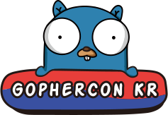

<p align="center"></p>

<h1 align="center">GopherCon Korea</h1>
<p align="center">GopherCon Korea Website</p>

## Getting started

### Overview

| Name             | Version |
| ---------------- | ------- |
| next             | 13.4.6  |
| react            | 18.2.0  |
| react-router-dom | 6.10.0  |
| typescript       | 5.1.3   |

### Installation

```bash
yarn
yarn prepare
```

### Start

```bash
yarn start
```

### Build

```bash
yarn build
```

### Test

```bash
yarn test
```

### Lint

```bash
# eslint
yarn lint:fix

# prettier
yarn format
```
